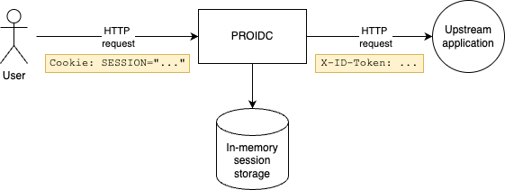

[.text-justify]
= PROIDC
:reproducible:
:doctype: article
:author: Herman Ciechanowiec
:email: herman@ciechanowiec.eu
:chapter-signifier:
:sectnums:
:sectnumlevels: 5
:sectanchors:
:toc: left
:toclevels: 5
:icons: font
// Docinfo is used for foldable TOC.
// -> For full usage example see https://github.com/remkop/picocli
:docinfo: shared,private
:linkcss:
:stylesdir: https://www.ciechanowiec.eu/linux_mantra/
:stylesheet: adoc-css-style.css

== Overview
_PROIDC_ is a simple Google https://openid.net/specs/openid-connect-core-1_0.html[OIDC-based^] security gateway in front of https://github.com/ciechanowiec/sling_rocket[an SR Instance of the _Sling Rocket_ Framework] ("*upstream application*"). It has the following capabilities:
[upperalpha]
. xref:#login-page[].
. xref:#oidc-authentication-and-token-relay[]
. xref:#oidc-logouts[].
. xref:#csrf-protection[].

== Features
[[login-page]]
=== Login Page

[upperalpha]
. _PROIDC_ provides a login page at the `/login` path, which serves as the entry point for the authentication process. When an unauthenticated user tries to access a protected resource, they are redirected to this page before being sent to the OIDC provider.
. _PROIDC_ comes with a default login page. However, it can be replaced with a custom one by specifying the `LOGIN_PAGE` configuration property. This property can point to any file resource, such as one on the classpath or the local filesystem.
. The steps below outline an example of how to use a custom login page when running _PROIDC_ as a xref:#docker-setup[Docker container].
[upperroman]
.. Create a custom login HTML file (e.g., `custom_login.html`) in the same directory as the `docker-compose.yml` where the _PROIDC_ service is specified.
.. In the `docker-compose.yml`, mount the custom login HTML file into the container at `/config/custom_login.html` path:
+
[source,yaml]
----
services:
  proidc:
    # ...
    volumes:
      # ...
      - type: bind
        source: custom_login.html
        target: /config/custom_login.html
        read_only: true
----
+
.. Set the `LOGIN_PAGE` environment variable in the `.env` file or directly in `docker-compose.yml` to point to the mounted file using the `file:` prefix:
+
[source,properties]
----
LOGIN_PAGE=file:/config/custom_login.html
----
+
When the application starts, it will serve the `custom_login.html` file at the `/login` URL. The value of this property must be a valid https://docs.spring.io/spring-framework/reference/core/resources.html#resources-resource[`org.springframework.core.io.Resource`] location.

[[oidc-authentication-and-token-relay]]
=== OIDC Authentication & ID Token Relay

_PROIDC_ xref:#oidc-authentication[performs OIDC authentication against Google as an authentication provider] and xref:#id-token-relay[passes the extracted ID Token to the upstream application] in a two-step process described below.

[[oidc-authentication]]
==== OIDC Authentication
Firstly, _RPOIDC_ intercepts the request to handle OIDC authentication.

[upperalpha]
. _PROIDC_ checks if the request is authenticated. A request is considered authenticated if it includes a https://docs.spring.io/spring-session/reference/configuration/common.html#custom-cookie-options[`SESSION` cookie] that points to a valid, non-expired in-memory https://docs.spring.io/spring-session/reference/index.html[session].
. *If the request is NOT authenticated:*
+
[upperroman]
.. _PROIDC_ triggers the OAuth2 login process.
.. _PROIDC_ terminates the current request and sends a `302 Found` redirect response to the user's browser, pointing them to the Google OIDC provider for login.
.. After a successful login with Google, the provider redirects the user back to _PROIDC_. _PROIDC_ intercepts this callback, creates an in-memory session containing the user's authentication details (including the ID Token), and issues another `302 Found` redirect. This final redirect sends the user to their originally requested URL and includes a `Set-Cookie` header for the `SESSION` identifier.
.. The user's browser now makes the original request again, but this time it includes the `SESSION` cookie, so the flow proceeds as described below.
. *If the request IS authenticated:*
+
The security check passes, and the request, now containing an authenticated user principal, is passed to the next stage.

[[id-token-relay]]
==== ID Token Relay
After successful xref:#oidc-authentication[OIDC authentication], _PROIDC_ sets the ID Token header.
[upperalpha]
. As a security precaution, _PROIDC_ firstly creates a version of the request with the ID Token header (xref:#id-token-header-name[`X-ID-Token` by default]) and the https://docs.spring.io/spring-session/reference/configuration/common.html#custom-cookie-options[cookie `SESSION`] [#id-token-header-and-session-cookie-deletion]#removed#, ensuring that no token from an external client can be passed through.
. _PROIDC_ then retrieves the ID Token from the authenticated user's session data established during xref:#oidc-authentication[OIDC authentication]. The trusted ID Token is added to the request as a respective header (xref:#id-token-header-name[`X-ID-Token` by default]).
. The modified request, now containing the ID Token, is forwarded to the upstream application.

[[oidc-logouts]]
=== OIDC Logouts

_PROIDC_ implements an OIDC-compliant logout mechanism which ensures that a user's session is terminated locally. To enhance security, the logout process is restricted to `POST` requests.

The logout procedure is executed as follows:
[upperalpha]
. A client initiates the logout process by sending a `POST` request to the `/logout` endpoint. Direct navigation or `GET` requests to this endpoint are explicitly disallowed.
. Since the `POST` request to the `/logout` endpoint is a state-changing request, it must meet the xref:#csrf-protection[CSRF requirements] for state-changing requests. Additionally, since the `/logout` endpoint allows only authenticated requests, the logout request must include the authentication xref:#oidc-authentication[cookie `SESSION`].
. Example of the logout request:
+
[source,bash]
----
curl --verbose \
     --request POST \
     --cookie "SESSION=<SESSION_COOKIE>; XSRF-TOKEN=<XSRF_TOKEN_COOKIE>" \
     --header "X-XSRF-TOKEN: <XSRF_TOKEN>" \
     http://localhost:9090/logout
----
+
[TIP]
xref:#oidc-authentication[`<SESSION_COOKIE>`], xref:#csrf-protection[`<XSRF_TOKEN_COOKIE>`] and xref:#csrf-protection[`<XSRF_TOKEN>`] should be replaced with the respective values.
. In the response to the logout request:
[upperroman]
[[upstream-logout-request]]
.. _PROIDC_ sends a `POST` request to the upstream application's logout endpoint, including the user's ID Token in the xref:#id-token-header-name[configured header (`X-ID-Token` by default)]. This allows the upstream application to terminate its own session for the user. The URL for this endpoint is configurable via the xref:#upstream-app-logout-uri[`UPSTREAM_APP_LOGOUT_URI` property].
.. After notifying the upstream application, _PROIDC_ proceeds with the standard OIDC logout. It invalidates the user's local session, terminating their authenticated state within the _PROIDC_. Since Google (the OIDC provider) does not provide an endpoint for remote logout, _PROIDC_ only performs a local logout. The user is then redirected back to the xref:#login-page[`/login` page]. With the session terminated, any subsequent attempt to access a protected resource will re-initiate the authentication flow.
. Example of the response to the logout request:
+
[source,bash]
----
< HTTP/1.1 302 Found
< Location: /login?logout
< Cache-Control: no-cache, no-store, max-age=0, must-revalidate
< Pragma: no-cache
< Expires: 0
< X-Content-Type-Options: nosniff
< X-Frame-Options: DENY
< X-XSS-Protection: 0
< Referrer-Policy: no-referrer
< set-cookie: XSRF-TOKEN=; Max-Age=0; Expires=Tue, 23 Sep 2025 20:52:36 GMT; Path=/; HTTPOnly
< set-cookie: SESSION=d7417235-db1e-47b0-80a7-0ee50edc9e10; Path=/; Secure; HTTPOnly; SameSite=Lax
< content-length: 0
----

[[csrf-protection]]
=== CSRF Protection
_PROIDC_ mitigates https://en.wikipedia.org/wiki/Cross-site_request_forgery[Cross-Site Request Forgery (CSRF) attacks] by implementing the stateless _Double Submit Cookie_ pattern. The process involves two distinct phases: CSRF token acquisition by the client, followed by the submission and validation of the CSRF token for each state-changing request.

==== Token Exchange

[upperalpha]
. *PHASE 1: CSRF Token Acquisition*
[upperroman]
.. *Theory*
+
To perform a state-changing operation, the client application must first acquire a CSRF token. This is achieved by sending an authenticated `GET` request to the `/csrf` endpoint. In response, _PROIDC_ generates a unique, cryptographically secure CSRF token and stores it in the server-side user session. The server's HTTP response provides this information to the client through two components:
+
[lowergreek]
... A `Set-Cookie` header for `XSRF-TOKEN`. The value of this `XSRF-TOKEN` cookie is a key used by the server to identify the corresponding CSRF token in the user's session. The `XSRF-TOKEN` cookie is marked as `HttpOnly` to prevent access from client-side scripts, thereby enhancing security against XSS attacks.
... A JSON response body containing the actual CSRF token value, which must be handled by the client application.
.. *Example*
[lowergreek]
... Example of a CSRF token acquisition request:
+
[source,bash]
....
❯ curl --verbose \
  --header "Cookie: SESSION=dc95f730-2071-4a40-947e-d374a9280adc" \
  http://localhost:9090/csrf
....
... The server responds by setting the `XSRF-TOKEN` cookie (the key) and providing the CSRF token in the JSON payload. Note that the `XSRF-TOKEN` cookie value and the CSRF token value serve different purposes and are not identical:
+
[source,http]
----
< HTTP/1.1 200 OK
< set-cookie: XSRF-TOKEN=42b45ee9-927e-4592-a53b-ae307124cc40; Path=/; HttpOnly
< Content-Type: application/json
< ...

{
  "headerName": "X-XSRF-TOKEN",
  "parameterName": "_csrf",
  "token": "T_ktQKyVJJcQbsRyZBv3IAdXLCC4UdKn4gcatpUBHj-Jg_gOe8tPdJnwQa49V_ZFATbDFT5lAUGNYrCKg2IphqIwLAvq4Mw-"
}
----
+
The browser will automatically manage the `XSRF-TOKEN` cookie. The client application is responsible for extracting and retaining the `token` value from the JSON response body for subsequent use.

. *PHASE 2: Protected Request Submission and Validation*
[upperroman]
.. With the CSRF token acquired, the client may now submit a state-changing request (e.g., `POST`, `PUT`, `DELETE`).
.. For the request to be valid, the client must submit both the [#xsrf-token-cookie]#`XSRF-TOKEN` cookie# and the CSRF token. The browser will automatically include the `XSRF-TOKEN` cookie in the request. [#x-xsrf-token-header]#The client application must explicitly include an `X-XSRF-TOKEN` header containing the CSRF token value obtained in the acquisition phase#.
.. Upon receiving the request, _PROIDC_ performs a validation sequence:
[lowergreek]
... It extracts the key from the `XSRF-TOKEN` cookie.
... It uses this key to retrieve the expected CSRF token from the server-side user session.
... It performs a constant-time comparison between the expected CSRF token and the CSRF token received in the `X-XSRF-TOKEN` header. If the values match, the request is deemed legitimate and is forwarded to the upstream application. If the values do not match, or if either the `XSRF-TOKEN` cookie or `X-XSRF-TOKEN` header is absent, the request is rejected with an HTTP `403 Forbidden` status code.
... Example of a state-changing request:
+
[source,bash]
----
❯ curl --verbose \
  --request POST \
  --header "Cookie: SESSION=dc95f730-2071-4a40-947e-d374a9280adc; XSRF-TOKEN=42b45ee9-927e-4592-a53b-ae307124cc40" \
  --header "X-XSRF-TOKEN: T_ktQKyVJJcQbsRyZBv3IAdXLCC4UdKn4gcatpUBHj-Jg_gOe8tPdJnwQa49V_ZFATbDFT5lAUGNYrCKg2IphqIwLAvq4Mw-" \
  --header "Content-Type: application/json" \
  --data '{"email": "new.email@example.com"}' \
  http://localhost:9090/api/profile
----
... As the submitted `X-XSRF-TOKEN` header value matches the CSRF token associated with the session key from the `XSRF-TOKEN` cookie, the validation succeeds.
+
Example of a successful response:
+
[source,http]
----
< HTTP/1.1 200 OK
< Content-Type: application/json
< ...

{
  "status": "success",
  "message": "Profile updated successfully."
}
----

==== HTML Forms Supplementation
All HTML forms must be supplemented to handle CSRF protection correctly. Standard HTML form submissions do not support adding the custom `X-XSRF-TOKEN` HTTP header required by _PROIDC_'s security policy. Therefore, form submissions must be performed via AJAX rather than through native browser submission.

The JavaScript code below provides a generic implementation. It intercepts a form's default submission event and re-sends the form data using an AJAX `fetch` request. This allows for the inclusion of the required `X-XSRF-TOKEN` header, ensuring the request is compliant with the CSRF protection mechanism.

.Show JavaScript
[%collapsible]
====
[source,javascript]
----
document.addEventListener('DOMContentLoaded', () => {
    // Select all forms on the page
    document.querySelectorAll('form').forEach(form => {
        // Add a submit event listener to each form
        form.addEventListener('submit', async (event) => {
            // Prevent the default browser submission
            event.preventDefault();

            const action = form.action;
            const method = form.method.toUpperCase();
            const formData = new FormData(form);
            const headers = {};

            // CSRF protection is needed for state-changing methods like POST, PUT, DELETE
            if (['POST', 'PUT', 'DELETE', 'PATCH'].includes(method)) {
                try {
                    // Attempt to fetch the CSRF token.
                    // This allows the form to work even if the /csrf endpoint is not available
                    // (e.g., when accessing the upstream app directly without the gateway).
                    const csrfResponse = await fetch('/csrf');
                    if (csrfResponse.ok) {
                        const csrfData = await csrfResponse.json();
                        // Add the CSRF token to the request headers
                        headers[csrfData.headerName] = csrfData.token;
                    } else {
                        console.warn(`Could not fetch CSRF token (status: ${csrfResponse.status}). Submitting form without it.`);
                    }
                } catch (error) {
                    console.warn('Network error while fetching CSRF token. Submitting form without it.', error);
                }
            }

            try {
                // Submit the form data using the Fetch API
                const response = await fetch(action, {
                    method: method,
                    headers: headers,
                    body: formData,
                    redirect: 'follow' // Automatically follow redirects
                });

                // If the server responded with a redirect, navigate the browser to the new URL.
                // This is the expected behavior for actions like logout.
                if (response.redirected) {
                    window.location.href = response.url;
                    return;
                }

                if (response.ok) {
                    // If the submission was successful and there was no redirect,
                    // perform a navigation to the current URL to reflect state changes.
                    // Using href assignment instead of reload() avoids the browser
                    // restoring the form field content.
                    window.location.href = window.location.href;
                } else {
                    // If the server returns an error, log it and inform the user.
                    const errorText = await response.text();
                    console.error('Form submission failed:', response.status, response.statusText, errorText);
                    alert(`Form submission failed: ${response.statusText}`);
                }
            } catch (error) {
                // Handle network errors that occur during the form submission itself.
                console.error('An error occurred during form submission:', error);
                alert('A network error occurred during form submission.');
            }
        });
    });
});
----
====

[[configuration]]
== Configuration
=== All Configuration Properties

_PROIDC_ is based on a https://docs.spring.io/spring-cloud-gateway/reference/[Spring Cloud Gateway] and https://docs.spring.io/spring-security/reference/index.html[Spring Security]. Therefore, the configuration of _PROIDC_ is partially a proxy for the underlying Spring configuration properties which are referred to in the table below.

[cols="^.^1,^.^3,.^3", options="header"]
|===
^| Environment Variable ^|  Default Value ^|Description

|`SERVER_PORT`
|`9090`
|Value for the https://docs.spring.io/spring-boot/appendix/application-properties/index.html#application-properties.server.server.port[`server.port` property].

|`SERVER_SESSION_TIMEOUT`
|`60m`
|Value for the https://docs.spring.io/spring-boot/appendix/application-properties/index.html#application-properties.server.server.reactive.session.timeout[`server.reactive.session.timeout` property].

|`GOOGLE_CLIENT_ID`
|
|Value for the https://docs.spring.io/spring-security/reference/servlet/oauth2/login/core.html[`spring.security.oauth2.client.registration.google.client-id` property].

|`GOOGLE_CLIENT_SECRET`
|
|Value for the https://docs.spring.io/spring-security/reference/servlet/oauth2/login/core.html[`spring.security.oauth2.client.registration.google.client-secret` property].

|`GOOGLE_SCOPE`
|`openid,profile,email`
|Value for the https://docs.spring.io/spring-security/reference/servlet/oauth2/login/core.html[`spring.security.oauth2.client.registration.google.scope` property].

|`GOOGLE_REDIRECT_URI`
|`++{baseUrl}/login/oauth2/code/{registrationId}++`
|Value for the https://docs.spring.io/spring-security/reference/servlet/oauth2/login/core.html[`spring.security.oauth2.client.registration.google.redirect-uri` property].

|`UPSTREAM_APP_URI`
|`http://localhost:8080`
|URI of the upstream application defined in the https://docs.spring.io/spring-cloud-gateway/reference/spring-cloud-gateway-server-webflux/configuration.html[`spring.cloud.gateway.server.webflux.routes.uri` property].

|[#upstream-app-logout-uri]#`UPSTREAM_APP_LOGOUT_URI`#
|`http://localhost:8080/api/logout`
|URI of the upstream application where xref:#upstream-logout-request[OIDC logout requests are sent].

|[#id-token-header-name]#`ID_TOKEN_HEADER_NAME`#
|`X-ID-Token`
|The name of the HTTP header used to pass the ID Token to the upstream service.

|`LOGGING_LEVEL`
|`INFO`
|Value for the https://docs.spring.io/spring-boot/reference/features/logging.html#features.logging.log-levels[`logging.level.root` property].

|`LOGIN_PAGE`
|`classpath:static/login.html`
|See the xref:#login-page[] section.

|`HEADERS_TO_REMOVE`
|`Authorization,X-XSRF-TOKEN`
|Comma-separated names of HTTP headers that should be removed from the request before the request is relayed to the upstream application.

The default value of this configuration property ensures that the following headers are removed: +
1) https://developer.mozilla.org/en-US/docs/Web/HTTP/Reference/Headers/Authorization[`Authorization`] (the reason for that is that with _PROIDC_ authorization is supposed to be performed via an xref:#id-token-relay[ID Token relay] rather than via the `Authorization` header) +
2) xref:#x-xsrf-token-header[X-XSRF-TOKEN]

Regardless of this setting, xref:#id-token-header-and-session-cookie-deletion[the ID Token header from the original request sent by the client is always removed].

|`COOKIES_TO_REMOVE`
|`sling.formauth,sling.sudo,XSRF-TOKEN`
|Comma-separated names of https://developer.mozilla.org/en-US/docs/Web/HTTP/Guides/Cookies#creating_removing_and_updating_cookies[cookies] that should be removed from the request before the request is relayed to the upstream application.

The default value of this configuration property ensures that the following cookies are removed: +
1) https://sling.apache.org/documentation/the-sling-engine/authentication/authentication-authenticationhandler/form-based-authenticationhandler.html#configuration[`sling.formauth`] +
2) https://github.com/apache/sling-org-apache-sling-auth-core/blob/bb26414245c1bcc573f3e9aaa9fb1c921babf92b/src/main/java/org/apache/sling/auth/core/impl/SlingAuthenticator.java#L126[`sling.sudo`] +
3) xref:#xsrf-token-cookie[XSRF-TOKEN]

Regardless of this setting, xref:#id-token-header-and-session-cookie-deletion[the `SESSION` cookie from the original request sent by the client is always removed].

|`EXPECTED_HOSTED_DOMAIN_REGEX`
|`.*`
|The property defines a regular expression (regex) for the expected `hd` (hosted domain) claim of the ID Token.

The `hd` claim indicates the domain associated with the Google Workspace or Cloud organization of the user. The claim is present only if the user belongs to a Google Workspace or Cloud organization.

This configuration property allows restricting authentication to users belonging to specific domains. The value of the `hd` claim from the verified ID Token is matched against this regular expression. If the value does not match, the authentication attempt will be rejected.

If the `hd` claim is not present in the ID Token, it is treated as an empty string for the purpose of this validation. Therefore, the authentication will only pass if the configured regex matches an empty string.

The default value is `.*`, which matches any value, including an empty string, thus allowing users both belonging and not belonging to some domain. To require a specific domain like `example.com`, the value should be set to `example\.com` (note that this would reject users without the `hd` claim).

|`PATHS_TO_BLOCK_PATTERNS`
|`++/bin*/**,/bin/browser*/**,/bin/cpm*/**,/bin/packages*/**,/bin/public/clientlibs*/**,/bin/users*/**,/dav*/**,/libs*/**,/libs/sling/topology*/**,/server*/**,/system*/**,/system/console*/**,/system/health*/**,/system/sling/login*/**,/system/sling/form/login*/**,/system/sling/info*/**,/system/sling/logout*/**,/system/userManager*/**++`
|See xref:#paths-to-block-patterns[] for details.

|===

[[paths-to-block-patterns]]
=== `PATHS_TO_BLOCK_PATTERNS`
[upperalpha]
. The `PATHS_TO_BLOCK_PATTERNS` configuration property determines which https://en.wikipedia.org/wiki/URL#Syntax[URL paths] must always be blocked so that no requests targeting those paths are ever proxied to the upstream application.
. Both authorized and unauthorized requests are blocked.
. Responses to all blocked requests have a https://developer.mozilla.org/en-US/docs/Web/HTTP/Reference/Status/302[`302 Found` status code] and redirect to the root path, i.e. `/`.
. The value of the configuration property should be a comma-separated list of path patterns to be blocked. Every specified path pattern must be a valid https://docs.spring.io/spring-framework/docs/5.0.0.M4_to_5.0.0.M5/Spring%20Framework%205.0.0.M5/org/springframework/web/util/patterns/PathPattern.html[`PathPattern`].
+
To block all requests that are targeting a path that starts with some specific string, it is recommended to use syntax `++/<starting-string>*/**++`. For instance, for the paths starting with `/data/clients`, the syntax should be `++/data*/clients/**++`.
. The default value of this configuration property blocks the following path patterns:
[upperroman]
.. `/bin*/**`
[lowergreek]
... https://github.com/ist-dresden/composum-nodes/blob/855483a5a9e91034265c4e419cae9052a020be07/console/src/main/java/com/composum/sling/nodes/browser/BrowserServlet.java#L24[`/bin/browser*/**`]
... https://github.com/ist-dresden/composum-nodes[`/bin/cpm*/**`]
... https://github.com/ist-dresden/composum-nodes/blob/855483a5a9e91034265c4e419cae9052a020be07/pckgmgr/src/main/java/com/composum/sling/core/pckgmgr/view/PackagesServlet.java#L24[`/bin/packages*/**`]
... https://github.com/ist-dresden/composum-nodes/blob/2323c8af1ab475673bbc2d14976d7312380e1db1/commons/src/main/java/com/composum/sling/clientlibs/servlet/ClientlibCategoryServlet.java#L35[`/bin/public/clientlibs*/**`]
... https://github.com/ist-dresden/composum-nodes/blob/855483a5a9e91034265c4e419cae9052a020be07/usermgr/src/main/java/com/composum/sling/core/usermanagement/UserManagerServlet.java#L24C1-L24C36[`/bin/users*/**`]
.. https://sling.apache.org/documentation/development/repository-based-development.html#webdav-support[`/dav*/**`]
.. `/libs*/**`
[lowergreek]
... https://github.com/apache/sling-org-apache-sling-discovery-base/blob/891d40e3a4156d8e1320f1c5b011f8dd49c09603/src/main/java/org/apache/sling/discovery/base/connectors/ping/TopologyConnectorServlet.java#L110[`/libs/sling/topology*/**`]
.. https://sling.apache.org/documentation/development/repository-based-development.html#davex-support[`/server*/**`]
.. `/system*/**`
[lowergreek]
... https://felix.apache.org/documentation/subprojects/apache-felix-web-console.html#_configuration[`/system/console*/**`]
... https://github.com/apache/felix-dev/blob/1692706ec713ffb14fec63711ababacd4e58166d/healthcheck/README.md#health-check-servlet[`/system/health*/**`]
... https://github.com/apache/sling-org-apache-sling-auth-core/blob/60a1f92939b1f29ace8266560c0acdce7ee229db/src/main/java/org/apache/sling/auth/core/impl/LoginServlet.java#L49[`/system/sling/login*/**`]
... https://sling.apache.org/documentation/the-sling-engine/authentication/authentication-authenticationhandler/form-based-authenticationhandler.html#configuration[`/system/sling/form/login*/**`]
... https://sling.apache.org/documentation/bundles/rendering-content-default-get-servlets.html#slinginfoservlet[`/system/sling/info*/**`]
... https://github.com/apache/sling-org-apache-sling-auth-core/blob/60a1f92939b1f29ace8266560c0acdce7ee229db/src/main/java/org/apache/sling/auth/core/impl/LogoutServlet.java#L74[`/system/sling/logout*/**`]
... https://sling.apache.org/documentation/bundles/managing-users-and-groups-jackrabbit-usermanager.html[`/system/userManager*/**`]

[[docker-setup]]
== Docker

This application is designed to be run as a Docker container. A `docker-compose.yml` file is provided in the repository to serve as a template for running the application.

=== Image
The application image, `ciechanowiec/proidc:1.1.0`, is available on Docker Hub. Alternatively, you can build it from the source using the provided `Dockerfile`.

=== Configuration
The application is configured via environment variables. For a complete list of available properties, please refer to the xref:#configuration[Configuration section] and the `docker-compose.yml` template.

== License
The program is subject to MIT No Attribution License

Copyright © 2025 Herman Ciechanowiec

Permission is hereby granted, free of charge, to any person obtaining a copy of this software and associated documentation files (the 'Software'), to deal in the Software without restriction, including without limitation the rights to use, copy, modify, merge, publish, distribute, sublicense, and/or sell copies of the Software, and to permit persons to whom the Software is furnished to do so.

The Software is provided 'as is', without warranty of any kind, express or implied, including but not limited to the warranties of merchantability, fitness for a particular purpose and noninfringement. In no event shall the authors or copyright holders be liable for any claim, damages or other liability, whether in an action of contract, tort or otherwise, arising from, out of or in connection with the Software or the use or other dealings in the Software.
